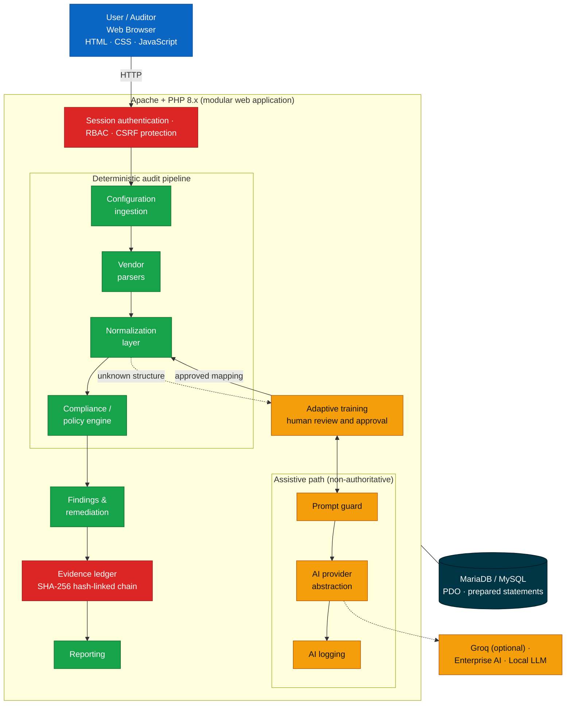
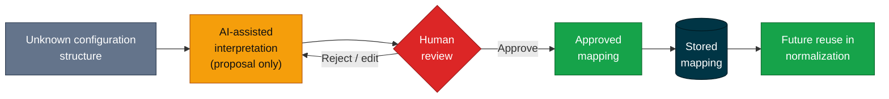
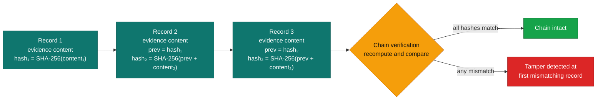

<div align="center">

# NexAud

### Next Gen Network Security Auditor

**AI-Driven Multi-Vendor Network Security Compliance Auditor**

*Parse. Normalize. Evaluate. Prove.*

<br>


-F55036?style=for-the-badge)


<br>

[Overview](#1-overview) · [Architecture](#5-architecture) · [Workflow](#7-processing-workflow) · [Evidence](#11-evidence-integrity--blockchain-theme) · [Setup](#15-installation--setup) · [Demo](#19-demonstration-workflow) · [Roadmap](#23-future-roadmap)

</div>

---

## Table of Contents

| | | |
|---|---|---|
| [1. Overview](#1-overview) | [10. AI-Assisted Adaptive Training](#10-ai-assisted-adaptive-training) | [19. Demonstration Workflow](#19-demonstration-workflow) |
| [2. Problem Statement](#2-problem-statement) | [11. Evidence Integrity & Blockchain Theme](#11-evidence-integrity--blockchain-theme) | [20. Testing](#20-testing) |
| [3. Solution](#3-solution) | [12. Security Architecture](#12-security-architecture) | [21. Troubleshooting](#21-troubleshooting) |
| [4. Key Capabilities](#4-key-capabilities) | [13. Repository Structure](#13-repository-structure) | [22. Current Prototype Capabilities](#22-current-prototype-capabilities) |
| [5. Architecture](#5-architecture) | [14. Prerequisites](#14-prerequisites) | [23. Future Roadmap](#23-future-roadmap) |
| [6. Technology Stack](#6-technology-stack) | [15. Installation & Setup](#15-installation--setup) | [24. Project Context](#24-project-context) |
| [7. Processing Workflow](#7-processing-workflow) | [16. Database Setup](#16-database-setup) | [25. License / Usage Note](#25-license--usage-note) |
| [8. Supported Vendors](#8-supported-vendors--configuration-paths) | [17. Application Configuration](#17-application-configuration) | |
| [9. Compliance Frameworks](#9-compliance-frameworks) | [18. Running NexAud](#18-running-nexaud) | |

---

## 1. Overview

NexAud is a web-based, multi-vendor network security compliance auditing platform. It ingests network device configuration files, interprets vendor-specific syntax, normalizes security-relevant settings into a common model, evaluates them against security controls from recognised frameworks, and produces findings, remediation guidance and traceable evidence.

The platform keeps every stage separate:

```
Configuration → Parsing → Normalization → Control Evaluation → Findings → Evidence → Reporting
```

> [!IMPORTANT]
> AI is an **assisting** component. PASS/FAIL compliance decisions are made by a **deterministic** rule engine and are repeatable for the same input and the same control set.

## 2. Problem Statement

**Problem Statement 26155: AI-Driven Multi-Vendor Network Security Compliance Auditor (NTRO).**

Networks are rarely built from a single vendor. The same security requirement, for example "disable insecure management protocols" or "send logs to a central server", is expressed through different syntax, hierarchy and defaults on each vendor and operating system. Manual review against frameworks such as CIS, NIST or DISA STIG is slow, differs between auditors, and is hard to reproduce or defend later.

## 3. Solution

NexAud isolates vendor-specific syntax from compliance logic.

| Concern | How NexAud handles it |
|---|---|
| Different vendor syntax | Vendor-specific **parsers** read raw configuration text |
| Different data shapes | A **normalization layer** converts parsed data into a vendor-neutral model |
| Inconsistent audit judgement | A **deterministic policy/compliance engine** evaluates the normalized model against selected controls |
| Weak audit trail | Results carry **structured evidence**, linked by SHA-256 hashes so tampering is detectable |
| Unfamiliar configuration formats | An **adaptive training path** where AI proposes, a human approves, and only approved mappings are reused |

Because framework evaluation never sees vendor syntax, adding a vendor or format does not require rewriting the compliance engine.

## 4. Key Capabilities

| Area | Capability |
|---|---|
| Ingestion | Upload/import of device configuration files linked to a device record |
| Parsing | Vendor parser layer (Cisco, Fortinet/FortiGate, Palo Alto) plus an adaptive path for unknown formats |
| Normalization | Vendor-neutral model of security-relevant settings |
| Evaluation | Deterministic control evaluation with PASS/FAIL results |
| Frameworks | CIS, NIST SP 800-53, DISA STIG, ISO/IEC 27001:2022, Custom Policies |
| Findings | Findings management with remediation guidance |
| Evidence | Structured evidence per result, SHA-256 hash-linked chain, verification |
| Adaptive training | AI-assisted interpretation of unknown syntax with mandatory human approval |
| AI assistance | Explanations, remediation wording, copilot interaction through a provider abstraction |
| Access control | Session-based authentication, RBAC, CSRF protection, audit logging |
| Reporting | Report generation from analysis results |

## 5. Architecture

### 5.1 System architecture



### 5.2 Layered view

```mermaid
flowchart LR
    A["Raw configuration<br/>Cisco · Fortinet · Palo Alto · Unknown"]:::in
    B["Vendor parser"]:::p
    C["Normalized<br/>representation"]:::n
    D["Control mapping"]:::m
    E["Deterministic<br/>evaluation"]:::e
    F["Findings +<br/>remediation"]:::f
    G["Evidence<br/>(SHA-256 chain)"]:::v
    H["Report"]:::r

    A --> B --> C --> D --> E --> F --> G --> H

    classDef in fill:#64748B,stroke:#334155,color:#fff
    classDef p fill:#7C3AED,stroke:#5b21b6,color:#fff
    classDef n fill:#2563EB,stroke:#1d4ed8,color:#fff
    classDef m fill:#0891B2,stroke:#0e7490,color:#fff
    classDef e fill:#16A34A,stroke:#15803d,color:#fff
    classDef f fill:#F59E0B,stroke:#b45309,color:#111
    classDef v fill:#DC2626,stroke:#991b1b,color:#fff
    classDef r fill:#0F766E,stroke:#115e59,color:#fff
```



### 5.3 Design principles

| Principle | Meaning in NexAud |
|---|---|
| Separation of concerns | Parsing, normalization, evaluation, findings, evidence and reporting are separate modules |
| Deterministic decisions | Control evaluation does not call an AI model to decide PASS/FAIL |
| Human-in-the-loop learning | New mappings are stored only after human approval |
| Traceability | Results are tied to evidence; evidence records are hash-linked |

## 6. Technology Stack

### 6.1 Languages and platform

| Layer | Technology |
|---|---|
| Frontend |    |
| Backend |   |
| Database |   accessed through **PDO** |
| Dev environment |    |

### 6.2 Application design

| Area | Detail |
|---|---|
| Structure | Modular PHP web application |
| Access | Session-based authentication, RBAC, CSRF protection |
| Accountability | Audit logging, evidence ledger |
| Core modules | Parser layer, normalization layer, compliance/policy engine, findings management, training/mapping module, reporting module |

### 6.3 AI architecture

| Component | Description | Status |
|---|---|---|
| Provider abstraction | Application code targets a provider interface rather than a single vendor | Implemented |
| Groq provider | External provider; needs an API key |  |
| Enterprise AI provider abstraction | Hook for an organisation-hosted model endpoint | Deployment-specific |
| Local LLM provider abstraction | Hook for a locally hosted model | Deployment-specific |
| Prompt guard | Screens input passed to AI functions | Implemented |
| AI logging | Records AI interactions | Implemented |

> [!NOTE]
> No specific model names are pinned in this document. The model used depends on the provider you configure.

### 6.4 Frameworks


## 7. Processing Workflow

### 7.1 End-to-end user flow


### 7.2 Functional modules

| # | Module | Purpose |
|---|---|---|
| 1 | Authentication & RBAC | Sign-in, session handling, role-based access to features |
| 2 | Dashboard | Summary of devices, analyses and findings |
| 3 | Device Inventory | Create, list and select network devices to audit |
| 4 | Configuration Ingestion | Upload/import configuration files and associate them with a device |
| 5 | Vendor Parsing | Read vendor-specific syntax into structured data |
| 6 | Normalization | Map parsed vendor data to a vendor-neutral security model |
| 7 | Compliance Analysis | Deterministic evaluation of normalized data against selected controls |
| 8 | Controls / Frameworks | Maintain control sets (CIS, NIST SP 800-53, DISA STIG, ISO/IEC 27001:2022, Custom Policies) |
| 9 | Findings | Record and review PASS/FAIL results per control |
| 10 | Remediation | Corrective guidance for failed controls |
| 11 | Evidence Ledger | Structured evidence per result, linked by SHA-256 hashes |
| 12 | Evidence Verification | Recompute and check the hash chain to detect modification |
| 13 | Adaptive Training | Review and approve mappings for structures not yet understood |
| 14 | AI Copilot / AI Assistance | Explanations, remediation wording and interactive help through a configurable provider |
| 15 | Reports | Generate reports from analysis results |
| 16 | Audit Logs / security administration | Record security-relevant actions and support administrative review |

## 8. Supported Vendors / Configuration Paths

| Path | Badge | Description |
|---|---|---|
| Cisco |  | Parser and normalization path demonstrated |
| Fortinet / FortiGate |  | Parser and normalization path demonstrated |
| Palo Alto |  | Parser and normalization path demonstrated |
| Unknown / adaptive |  | For structures without a dedicated parser; routed to adaptive training |

Vendor-specific syntax is confined to the parser (and, where required, mapping) layer. Framework controls are written against the normalized representation, so new vendors or formats are added by supplying a parser and mappings, not by modifying the evaluation logic.

## 9. Compliance Frameworks

| Framework | Notes |
|---|---|
| CIS | Built-in control set |
| NIST SP 800-53 | Built-in control set |
| DISA STIG | Built-in control set |
| ISO/IEC 27001:2022 | Built-in control set |
| Custom Policies | Organisation-defined controls |

### Compliance engine

The engine evaluates normalized configuration data against deterministic controls. The same configuration and the same control set produce the same result, which is what makes results auditable and repeatable.

| AI does not | AI may assist with |
|---|---|
| Decide PASS/FAIL | Interpreting unknown syntax |
| Replace compliance rules | Explaining findings |
| Write to evidence without a deterministic result | Remediation wording, copilot interaction, adaptive training proposals |

## 10. AI-Assisted Adaptive Training



> [!IMPORTANT]
> **Human approval is a required step.** An AI-proposed interpretation is not used for compliance evaluation until a reviewer approves it. Once approved and stored, the mapping is reused for later configurations containing the same structure.

AI-backed functions are optional. Parsing, normalization, deterministic evaluation, findings, evidence and reporting do not depend on an AI provider.

## 11. Evidence Integrity & Blockchain Theme

### 11.1 Current prototype: tamper-evident cryptographic evidence chain

For each relevant compliance result, the system can associate structured evidence. Integrity is supported by cryptographic hashing:

| Property | Mechanism |
|---|---|
| Hashing | SHA-256 over configuration and evidence content |
| Linking | Each evidence record carries the hash of its predecessor |
| Verification | Chain verification recomputes hashes and checks the links |
| Tamper detection | Modifying a stored record breaks verification from that point onward |

Conceptual illustration of the hash-linking (field names are illustrative, not the database schema):



> [!WARNING]
> NexAud does **not** currently implement a decentralized blockchain. The current mechanism is a SHA-256 hash-linked evidence chain stored in the application database. It makes modification **detectable**; it does not by itself prevent a database administrator from rewriting the entire chain. This is why a distributed ledger appears under future work.

### 11.2 Future (not implemented)

**FUTURE:** production deployments in which multiple organisational parties need independently verifiable evidence may use a permissioned ledger such as Hyperledger Fabric. This is a roadmap item and is not required for, or present in, the current prototype.

## 12. Security Architecture

| Control | Description |
|---|---|
| Authentication | Session-based authentication |
| RBAC | Role-based access control restricting modules and actions by role |
| CSRF protection | Anti-CSRF protection for state-changing requests |
| Secure session handling | Server-side sessions with lifecycle managed in the application |
| Password protection / change flow | Passwords stored as protected hashes, not plaintext; password change flow provided |
| MFA / TOTP-compatible architecture | Authentication design is compatible with TOTP-based MFA. Verify in the running build whether MFA enrolment is enabled for your deployment |
| Prepared statements | Database access through PDO with prepared SQL statements |
| Audit logging | Security-relevant actions are logged |
| Login protection | Rate limiting / login protection **where implemented**; verify behaviour in the running build |
| Evidence hashing | SHA-256 hash-linked evidence chain (Section 11) |
| AI safeguards | Prompt guard and AI interaction logging |

### Repository hygiene

> [!CAUTION]
> **Never commit API keys, passwords or production secrets to GitHub.**

Never commit:

- `.env` files
- API keys
- passwords
- production database dumps
- private certificates
- private SSH keys
- sensitive customer or production network configurations

## 13. Repository Structure

```
NexAud/
├── ai/               AI provider abstraction, prompt guard, AI logging
├── analysis/         Analysis execution
├── api/              Application API handlers
├── assets/           Static frontend assets (CSS, JavaScript, images)
├── compliance/       Compliance / policy engine
├── config/           Application, database, security and AI configuration
├── configurations/   Device configuration handling
├── controls/         Controls and frameworks management
├── database/         Database SQL files
├── evidence/         Evidence ledger and verification
├── findings/         Findings and remediation
├── includes/         Shared application code
├── normalization/    Vendor-neutral normalization layer
├── parsers/          Vendor-specific parsers
├── reports/          Reporting
├── sample_configs/   Example configurations: Cisco, Fortinet, Palo Alto, Unknown
├── samples/          Additional sample material
├── sql/              Additional SQL files (including AI-related schema)
├── storage/          Runtime storage (must be writable by the web server)
├── tests/            Test and pipeline scripts
├── training/         Adaptive training / mapping module
├── uploads/          Uploaded configuration files (must be writable)
├── index.php
├── login.php
├── dashboard.php
├── logout.php
└── README.md
```

Directory descriptions reflect the intended role of each module. Where the purpose of an individual file is unclear, treat it as prototype code rather than production-ready.

## 14. Prerequisites

| Requirement | Notes |
|---|---|
| Operating system | Windows (primary development environment) |
| Web server | Apache (XAMPP is the reference environment) |
| PHP | PHP 8.x |
| PHP extensions | PDO with the MySQL driver (`pdo_mysql`) at minimum; further extensions the code needs are reported in the PHP/Apache error log |
| Database | MariaDB or MySQL |
| Admin tool | phpMyAdmin (bundled with XAMPP) |
| Browser | Modern web browser |
| Network | Internet access only if the OPTIONAL external AI provider is used |

Your XAMPP installation may differ from the reference environment (version, install path, ports). Adjust paths and ports accordingly.

## 15. Installation & Setup

1. **Obtain the project.**

   ```bash
   git clone <REPOSITORY_URL> NexAud
   ```

   Alternatively, copy the project folder into place.

2. **Place it under the Apache web root.**

   ```
   C:\xampp\htdocs\NexAud
   ```

   or, for a non-default installation:

   ```
   <APACHE_WEB_ROOT>\NexAud
   ```

3. **Start services.** In the XAMPP Control Panel (or your own setup), start **Apache** and **MySQL/MariaDB**.

4. **Check the PHP version** (the executable path depends on your installation):

   ```
   <XAMPP_DIR>\php\php.exe -v
   ```

   It should report PHP 8.x. To confirm the PDO MySQL driver is loaded:

   ```
   <XAMPP_DIR>\php\php.exe -m
   ```

   `pdo_mysql` should appear in the list.

5. **Set up the database:** see [Section 16](#16-database-setup).
6. **Configure the application:** see [Section 17](#17-application-configuration).
7. **Confirm `storage/` and `uploads/` are writable** by the account Apache runs as.

## 16. Database Setup

NexAud requires a MariaDB/MySQL database named **`nexaud`**.

1. Start **Apache** and **MySQL/MariaDB**.
2. Open **phpMyAdmin** (typically `http://localhost/phpmyadmin/`; include the port if Apache uses a non-default one).
3. Create a database named `nexaud` with a UTF-8 collation (for example `utf8mb4_general_ci`, or the collation your server provides).
4. Select `nexaud` and use the **Import** tab to import the project's **schema SQL**.
5. Apply the **seed / control / framework data** where the repository provides it.
6. Set the database credentials in the application configuration ([Section 17](#17-application-configuration)).
7. Open the application and confirm the login page loads without a database error.

### SQL files in the repository

The repository may contain several SQL files. Their intended roles:

| File | Intended purpose |
|---|---|
| `database/schema.sql` | Core application schema |
| `database/seed.sql` | Seed data (for example initial roles/users/base data) |
| `database/seed_builtin_frameworks.sql` | Built-in framework and control data |
| `sql/schema.sql` | Schema file in the `sql/` directory |
| `sql/ai_schema.sql` | Schema for AI-related tables |

> [!WARNING]
> **Do not blindly import every schema file.** `database/schema.sql` and `sql/schema.sql` may overlap. Open the files first, compare their `CREATE TABLE` statements, and import the applicable schema once. Importing overlapping schemas into one database can fail with "table already exists" errors or produce conflicting definitions. `sql/ai_schema.sql` is intended as a supplement for AI-related tables; check that it does not duplicate tables already created by the main schema.

Suggested order, once you have confirmed which files apply:

1. Main schema (one file only)
2. AI schema, if its tables are not already present
3. Seed data
4. Built-in framework / control data

If an import fails, fix the cause (for example a duplicate table) rather than re-importing over a partially populated database. In a test environment, dropping and recreating the empty `nexaud` database is a clean way to retry.

## 17. Application Configuration

Configuration lives under `config/`. Verify the exact file names in your checkout.

| Area | What to set |
|---|---|
| Database | Host, database name (`nexaud`), username, password |
| Application | Base URL / path (including the Apache port if non-default) and general settings |
| Security | Session, CSRF and authentication-related settings |
| AI provider | Provider selection and credentials (**OPTIONAL**) |

### Database (placeholders)

```
DB_HOST     = <DB_HOST>        # commonly localhost on a local XAMPP install
DB_NAME     = nexaud
DB_USER     = <DB_USER>
DB_PASSWORD = <DB_PASSWORD>
```

Use the credentials of a MySQL/MariaDB account that has access to `nexaud`. A fresh XAMPP install may use its default administrative account; beyond a local demo, create a dedicated account limited to `nexaud`.

### AI provider (OPTIONAL)

An API key is required **only** for AI-backed functions that use an external provider (for example Groq). Without one, parsing, normalization, deterministic evaluation, findings, evidence and reporting remain usable; AI-assisted features (explanations, copilot, AI-assisted interpretation of unknown syntax) will not be available through an external provider.

```
GROQ_API_KEY=<your-key>
```

Supply this through whichever configuration mechanism the repository uses for AI settings (see `config/` and `ai/`). Enterprise and local LLM providers are available through the provider abstraction and need endpoint details specific to your deployment.

> [!CAUTION]
> **Never commit API keys, passwords or production secrets to GitHub.** Keep real values in local configuration excluded from version control.

### Initial access

Use the administrator credentials defined during database seeding/initial setup. If the seed data provides a demonstration account, **change the default password immediately after first login.**

## 18. Running NexAud

1. Clone/copy the repository.
2. Place the project under the Apache web root.
3. Start Apache.
4. Start MySQL/MariaDB.
5. Create/import the database.
6. Configure the database connection.
7. Configure the OPTIONAL AI provider.
8. Open the application in a browser:

   ```
   http://localhost/<NEXAUD_DIRECTORY>/
   ```

   If Apache listens on a port other than 80, include it: `http://localhost:<PORT>/<NEXAUD_DIRECTORY>/`.
9. Log in.
10. Create or import a test device configuration (use files from `sample_configs/`).
11. Run analysis.
12. Review findings and evidence.
13. Verify evidence.
14. Generate a report.

### Sample configurations

`sample_configs/` contains example configuration files for demonstration and testing:

| Vendor | Purpose |
|---|---|
| Cisco | Cisco configuration path |
| Fortinet | Fortinet / FortiGate configuration path |
| Palo Alto | Palo Alto configuration path |
| Unknown | Exercises the adaptive training path |

> [!NOTE]
> These are **sample data for demonstration/testing only**. They are not production network configurations. Do not upload sensitive production configurations to a demonstration instance.

## 19. Demonstration Workflow

A short evaluator walkthrough:

```mermaid
flowchart LR
    D1["1. Login"] --> D2["2. Device<br/>inventory"] --> D3["3. Upload vendor<br/>configuration"] --> D4["4. Run compliance<br/>analysis"] --> D5["5. Normalized /<br/>control results"]
    D5 --> D6["6. PASS / FAIL<br/>findings"] --> D7["7. Open<br/>evidence"] --> D8["8. Verify evidence<br/>integrity"] --> D9["9. Adaptive<br/>training demo"] --> D10["10. Generate<br/>report"]

    classDef s fill:#0A66C2,stroke:#084a8f,color:#fff
    classDef k fill:#16A34A,stroke:#0f6b30,color:#fff
    classDef e fill:#DC2626,stroke:#991b1b,color:#fff
    classDef a fill:#F59E0B,stroke:#b45309,color:#111
    class D1,D2,D3 s
    class D4,D5,D6 k
    class D7,D8 e
    class D9,D10 a
```



1. **Login** with the administrator account from initial setup.
2. **Device inventory:** show the device list; create a device if none exists.
3. **Upload a vendor configuration** from `sample_configs/` (Cisco, Fortinet or Palo Alto) and associate it with the device.
4. **Run compliance analysis** with a chosen framework.
5. **Show normalized/control results:** observe how different vendor syntax maps to the same normalized settings and controls.
6. **Show PASS/FAIL findings** and the associated remediation guidance.
7. **Open evidence** for a result.
8. **Verify evidence integrity** using the chain verification function.
9. **Adaptive training:** upload the Unknown sample, observe the AI-assisted interpretation proposal, and approve the mapping through human review (requires the OPTIONAL AI provider).
10. **Generate a report.**

## 20. Testing

The `tests/` directory contains functional and pipeline test scripts that can be used to validate processing behaviour (parsing, normalization, evaluation).

The repository does **not** provide a single standardised test runner, and no PHPUnit setup is documented here. Run the individual PHP scripts in `tests/` directly with the PHP CLI, using each script's actual file name:

```
<XAMPP_DIR>\php\php.exe tests\<SCRIPT_NAME>.php
```

Review each script before running it, since some may require the database to be configured and populated, or may write to the database.

## 21. Troubleshooting

<details>
<summary><b>Apache or MySQL/MariaDB does not start</b></summary>

Another program may be using the port (for example IIS or another MySQL instance). Check the XAMPP Control Panel log, then stop the conflicting program or change the port in the service's configuration.
</details>

<details>
<summary><b>Database connection failure / incorrect credentials</b></summary>

Confirm MySQL/MariaDB is running, the `nexaud` database exists, and the host/name/user/password in `config/` are correct. Test the same username and password in phpMyAdmin, then update `config/` to match.
</details>

<details>
<summary><b>Incorrect PHP version or missing PHP extensions</b></summary>

Run `php -v` using the PHP bundled with your Apache; multiple PHP installations on one machine are common. Run `php -m` and confirm `pdo_mysql` is present. Enable required extensions in the `php.ini` used by Apache and restart Apache. The Apache/PHP error log names any other missing extension.
</details>

<details>
<summary><b>Cannot write to <code>storage/</code> or <code>uploads/</code></b></summary>

Ensure both directories exist and are writable by the account Apache runs as.
</details>

<details>
<summary><b>AI provider / API key problems</b></summary>

Confirm the key is set (`GROQ_API_KEY=<your-key>` or the equivalent in your configuration), the provider is selected, and the server has outbound internet access. Core non-AI features work without a key.
</details>

<details>
<summary><b>Configuration parsing errors</b></summary>

Confirm the file is a complete, text-format configuration for the selected vendor. If the structure is not recognised, use the Unknown/adaptive path.
</details>

<details>
<summary><b>Empty dashboard / no devices</b></summary>

The dashboard reflects stored data. Create a device, upload a configuration, then run an analysis.
</details>

<details>
<summary><b>Evidence verification problems</b></summary>

A verification failure means a record's content or link does not match its stored hash. Check whether records were edited directly in the database or data was partially imported; analyse a fresh test device to confirm normal operation.
</details>

Check the Apache error log and PHP error output first for most startup and runtime errors.

## 22. Current Prototype Capabilities

| Capability | Status |
|---|---|
| Multi-vendor configuration ingestion |  |
| Vendor parser layer |  |
| Vendor-neutral normalization |  |
| Multi-framework controls |  |
| Deterministic compliance evaluation |  |
| Findings and remediation |  |
| Evidence generation |  |
| SHA-256 evidence integrity |  |
| Tamper-evident evidence chain |  |
| Adaptive training/mapping |  |
| AI-assisted interpretation/explanation | -F59E0B?style=flat-square) |
| RBAC |  |
| Security controls |  |
| Reporting |  |

Not included in the current prototype: a decentralized blockchain, live device collection, continuous monitoring, SIEM/SOAR integration and enterprise identity integration (see roadmap).

## 23. Future Roadmap

> [!NOTE]
> **FUTURE WORK.** None of the items below are implemented in the current prototype or required to run it.

| Horizon | Item |
|---|---|
| Coverage | Additional vendors; more network OS versions; cloud security controls; expanded control libraries |
| Collection | Secure live device collection; continuous compliance monitoring |
| Integration | SIEM/SOAR integrations; enterprise identity integration |
| Platform | Distributed deployment; production-grade multi-tenant architecture |
| Evidence | Permissioned blockchain/evidence federation (for example Hyperledger Fabric) |

## 24. Project Context

| Item | Detail |
|---|---|
| Event | Smart India Hackathon 2026 |
| Problem Statement ID | 26155 |
| Problem Statement | AI-Driven Multi-Vendor Network Security Compliance Auditor |
| Organization | National Technical Research Organisation (NTRO) |
| Category | Software |
| Theme | Blockchain & Cybersecurity |

This repository is a prototype built for the hackathon submission and demonstration.

## 25. License / Usage Note

This repository is a hackathon prototype submitted for evaluation. No open-source license has been specified; unless a `LICENSE` file is added, all rights are reserved by the project team. Sample configurations are provided for demonstration only. Do not use the prototype with sensitive production data without a security review.

---

<div align="center">

**NexAud** · Smart India Hackathon 2026 · Problem Statement 26155 · NTRO


</div>
